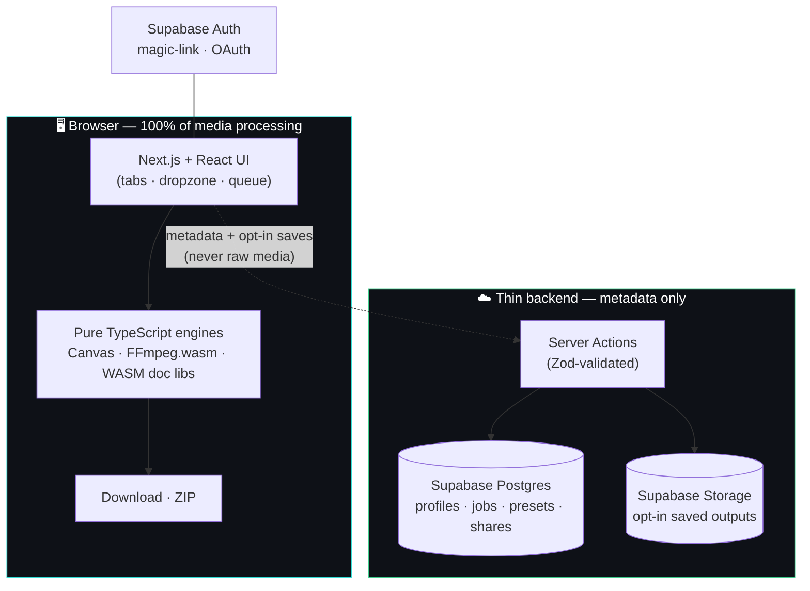
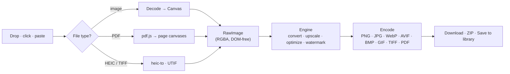
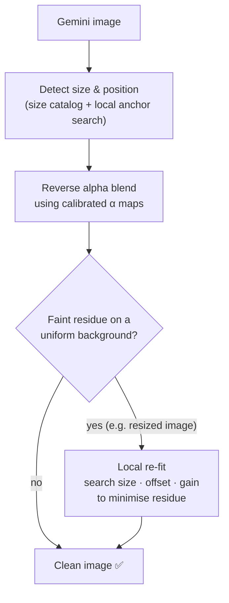
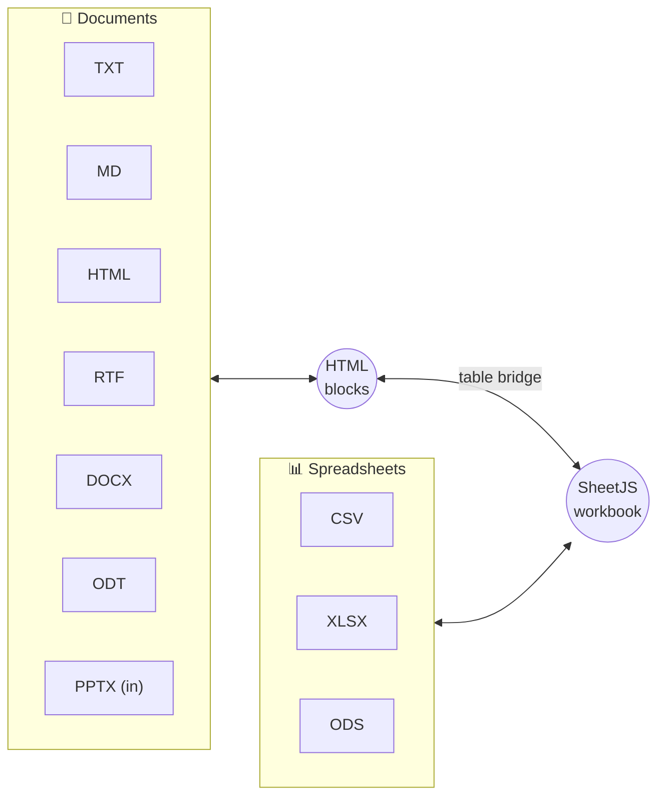

<div align="center">

# ⚡ ProxiPixel

### A privacy-first media studio that runs **entirely in your browser**

Convert, upscale, optimize, de-watermark, transcode video, and convert documents —
**your files never leave your device.** No queues, no uploads, no limits.

[](https://nextjs.org/)
[](https://react.dev/)
[](https://www.typescriptlang.org/)
[](https://tailwindcss.com/)
[](https://supabase.com/)
[](#testing)
[](./LICENSE)

[**Features**](#features) · [**Architecture**](#architecture) · [**How it works**](#how-it-works) · [**Quick start**](#quick-start)

</div>

---

## Overview

**ProxiPixel** is a local-first media toolkit built with **Next.js 15** and **TypeScript**.
Every transform — image conversion, AI-watermark removal, 4K upscaling, video transcoding,
and document/spreadsheet conversion — runs **client-side** using the Canvas API, WebAssembly
(FFmpeg.wasm), and pure TypeScript engines. The backend (Supabase) is intentionally thin: it
stores only **metadata** (job history, presets) and, *opt-in*, a single saved output — **never
your raw media**.

> **Why local-first?** It's **private** (files stay on your machine), **free** (no server
> compute to pay for), and **scales infinitely** (each browser does its own work).

---

## Features

ProxiPixel is organized as six focused tools, each in its own tab:

| Tool | What it does | Formats |
| :--- | :--- | :--- |
| 🔄 **Convert** | Re-encode images between formats, including PDF ⇄ image | PNG · JPG · WebP · AVIF · BMP · GIF · TIFF · PDF · HEIC (in) |
| 🔍 **Upscale** | Enlarge to **4K UHD** with gamma-correct Lanczos + Gaussian sharpening | Any image → up to 3840px long edge |
| 🪶 **Optimize** | Compress to a **target quality** or a **target file size** (binary-searched) | AVIF · WebP · JPG (+ width cap) |
| ✦ **Watermark** | Remove Gemini's visible watermark via exact **reverse alpha blending** | Gemini-generated PNG/JPG/WebP |
| 🎬 **Video** | Transcode, trim, crop, change fps, mute — via **FFmpeg.wasm** | MP4 (H.264) · WebM (VP9) · GIF |
| 📄 **Documents** | Convert documents & spreadsheets **both ways** | DOCX · ODT · RTF · MD · HTML · TXT · XLSX · CSV · ODS · PPTX (in) |

**Across all tools:**

- 🔒 **100% local processing** — no uploads, no network calls to transform a file.
- 📦 **Batch queue** — process many files, download individually or as a ZIP.
- 🖼️ **Before/after compare** slider and video preview.
- 🧹 **Automatic EXIF stripping** — re-encoding drops GPS / camera / timestamps; cards flag what was removed.
- 👤 **Optional accounts** (Supabase) — job history, named presets, and "save to library."
- ⌨️ **Accessible** — keyboard-navigable tabs, dropzones, and sliders.

---

## Architecture

ProxiPixel pushes all the heavy lifting into the browser and keeps the server stateless and small.



**Design principles**

1. **The engine is framework-agnostic.** Pure functions operate on `RawImage` (a DOM-free
   mirror of `ImageData`), so algorithms are unit-testable in Node and reused in any UI.
2. **Heavy code is lazy-loaded.** The watermark engine (~360 KB) and document libraries are
   `import()`-ed on first use, so the initial page stays light.
3. **The server never sees your media.** It records only metadata; saving an output is an
   explicit, single-file opt-in.

---

## How it works

### Image pipeline

Every image tool shares one pipeline: decode → operate on raw pixels → encode.



### Watermark removal — reverse alpha blending

Gemini composites its logo with standard alpha blending. ProxiPixel **inverts the math**
to recover the original pixels losslessly (no AI "hallucination"):

$$\text{watermarked} = \alpha \cdot \text{logo} + (1-\alpha)\cdot\text{original} \quad\Longrightarrow\quad \text{original} = \frac{\text{watermarked} - \alpha \cdot \text{logo}}{1 - \alpha}$$



> The local re-fit is **gated**: it only engages over a uniform background where a ghost is
> both visible and reliably correctable, and it's verified output-identical to the upstream
> engine on the standard catalog. On native Gemini sizes the base removal is lossless.

### Document conversion — two hubs, one bridge

Documents round-trip through an **HTML blocks** model; spreadsheets through a **SheetJS
workbook**; a table bridge connects the two families so you can go, e.g., `XLSX → Markdown`
or `HTML table → CSV`.



Powered by `mammoth` (DOCX read), `docx` (DOCX write), `SheetJS` (spreadsheets), `marked` +
`turndown` (Markdown ⇄ HTML), and `jszip` (ODT/PPTX). Legacy binary `.ppt` and `.pptx`
*export* are intentionally out of scope (they need server-side LibreOffice for fidelity).

---

## Tech stack

| Layer | Technology |
| :--- | :--- |
| **Framework** | Next.js 15 (App Router, Server Actions, RSC) · React 19 |
| **Language** | TypeScript (strict) |
| **Styling** | Tailwind CSS 3 · CSS custom properties |
| **Image engine** | Canvas API · pure-TS Lanczos / unsharp / BMP / optimize · vendored Gemini watermark engine |
| **Video** | FFmpeg.wasm (loaded on demand) |
| **Documents** | SheetJS · mammoth · docx · marked · turndown · jszip |
| **Backend** | Supabase (Postgres · Auth · Storage) · Drizzle ORM · Zod |
| **Tooling** | pnpm · ESLint · Prettier · Vitest · Playwright |

---

## Project structure

```text
proxipixel/
├── app/                      # Next.js App Router (pages, layouts, routes)
│   ├── page.tsx              #   / — the studio (all tools)
│   ├── login/ library/ presets/ s/[slug]/   # auth, library, presets, public shares
│   └── auth/callback/        #   OAuth / magic-link callback
├── components/               # React UI
│   ├── Studio.tsx Tabs.tsx DropZone.tsx Queue.tsx ...
│   ├── panels/               #   Convert · Upscale · Optimize · Watermark · Video
│   └── DocumentStudio.tsx    #   self-contained Documents tool
├── lib/
│   ├── engine/               # Framework-agnostic media engine (pure, unit-tested)
│   │   ├── upscale.ts encode.ts decode.ts optimize.ts raster.ts exif.ts pdf.ts
│   │   ├── video/            #   FFmpeg arg builder + runner
│   │   └── watermark/        #   typed wrapper + vendored reverse-alpha engine
│   ├── docs/                 # Document & spreadsheet conversion engine
│   │   ├── formats.ts        #   format registry + conversion matrix
│   │   └── convert.ts        #   HTML-hub + workbook-hub + bridges
│   ├── app/                  # Client state (store, process dispatch, types, toast, zip…)
│   └── supabase/             # Browser/server/admin clients + middleware
├── server/                   # Server Actions: jobs, presets, outputs, shares, validation
├── db/                       # Drizzle schema, SQL migrations, RLS + storage policies
├── tests/                    # Vitest unit tests (engine · server · docs)
└── e2e/                      # Playwright end-to-end tests + sample fixtures
```

---

## Quick start

### Prerequisites

- **Node.js ≥ 20**
- **pnpm** (`npm i -g pnpm`)
- A **Supabase** project (free tier) — *only needed for accounts/history; all tools work signed-out*

### 1 · Install

```bash
git clone https://github.com/<you>/proxipixel.git
cd proxipixel
pnpm install
```

### 2 · Configure environment

```bash
cp .env.example .env.local
```

Fill in `.env.local`:

| Variable | Where | Notes |
| :--- | :--- | :--- |
| `NEXT_PUBLIC_SUPABASE_URL` | Supabase → Settings → API | public |
| `NEXT_PUBLIC_SUPABASE_ANON_KEY` | Supabase → Settings → API | public |
| `SUPABASE_SERVICE_ROLE_KEY` | Supabase → Settings → API | **server-only**, never `NEXT_PUBLIC_` |
| `DATABASE_URL` | Supabase → Database (pooled) | runtime |
| `DIRECT_URL` | Supabase → Database (direct) | migrations |
| `NEXT_PUBLIC_SITE_URL` | your app URL | `http://localhost:3000` in dev |

> Skipping Supabase? The app still runs — every tool works locally; only auth, history, and
> "save to library" are disabled.

### 3 · Set up the database (optional, for accounts)

```bash
pnpm drizzle:migrate          # apply migrations
# then apply db/policies.sql, db/auth-setup.sql, db/storage-setup.sql in the Supabase SQL editor
```

### 4 · Run

```bash
pnpm dev          # → http://localhost:3000
```

---

## Testing

```bash
pnpm test         # Vitest — 57 unit tests (engine · server · docs)
pnpm test:e2e     # Playwright — real-browser conversion matrix across every tool
pnpm verify       # typecheck + lint + test + build (the full gate)
```

- **Unit tests** assert engine correctness against the reference (BMP header bytes, Lanczos
  size/constancy, gamma round-trip, EXIF GPS detection, FFmpeg arg strings, and every
  document conversion both ways).
- **E2E tests** drive a real Chromium browser over genuine sample files (in `e2e/fixtures/`,
  reproducible via `generate.mjs`) and assert real output bytes/MIME for:
  - the full **Convert** matrix — every image input → every output format;
  - **Upscale**, **Optimize** and **Watermark** across their option branches;
  - every **Documents** cross-conversion (doc⇄doc, sheet⇄sheet, cross-family);
  - the **Video** pipeline (FFmpeg.wasm) end-to-end.

  > AVIF *encoding* and heavy VP9/WebM *encoding* can't be exercised reliably in headless
  > Chromium (no AVIF encoder; the ~32 MB FFmpeg core reloads per page), so those output
  > paths are covered by the unit-tested encoders/argument builders instead. They work in
  > real Chrome/Edge.

---

## Scripts

| Script | Description |
| :--- | :--- |
| `pnpm dev` | Start the dev server |
| `pnpm build` / `pnpm start` | Production build / serve |
| `pnpm verify` | `typecheck && lint && test && build` |
| `pnpm typecheck` | `tsc --noEmit` |
| `pnpm lint` / `pnpm format` | ESLint / Prettier |
| `pnpm test` / `pnpm test:e2e` | Vitest / Playwright |
| `pnpm drizzle:generate` / `pnpm drizzle:migrate` | Generate / apply DB migrations |

---

## Privacy & security

- **Media never leaves the browser** for processing — no third-party services, no telemetry on your files.
- The database stores **metadata only** (`kind`, source name/format/size, options, output size, timestamp) — never raw media.
- **Saving an output** is an explicit, single-file opt-in to your private Storage bucket.
- **Row Level Security** (`db/policies.sql`) ensures users can only read/write their own rows.
- All Server Actions are **Zod-validated**; identity always comes from the server-verified session.
- A strict **Content-Security-Policy** and security headers are set in `next.config.ts`.

---

## Roadmap & limits

ProxiPixel is honest about what a browser can and can't do:

- **Upscale** is a high-quality *classical* pipeline (gamma-correct Lanczos + sharpening). It enlarges existing detail crisply but doesn't *invent* new detail like a trained super-resolution model.
- **Watermark** removal targets Gemini's *visible* bottom-right logo only — not invisible SynthID markers, and not other watermarks.
- **Documents**: `.pptx` is import-only and legacy binary `.ppt` is unsupported (true Office fidelity needs server-side LibreOffice, which would break the no-upload guarantee).

---

## Contributing

Contributions are welcome! Please run `pnpm verify` before opening a PR — it must pass
typecheck, lint, tests, and build.

---

## Acknowledgments

- The watermark engine (`lib/engine/watermark/vendor/`) is a vendored build of
  [**gemini-watermark-remover**](https://github.com/GargantuaX/gemini-watermark-remover) by
  GargantuaX, itself a JavaScript port of the
  [Gemini Watermark Tool](https://github.com/allenk/GeminiWatermarkTool) by Allen Kuo —
  both **MIT licensed**. The reverse-alpha method and calibrated masks are © their authors.
- Built with [Next.js](https://nextjs.org/), [Supabase](https://supabase.com/),
  [FFmpeg.wasm](https://ffmpegwasm.netlify.app/), [SheetJS](https://sheetjs.com/),
  [mammoth.js](https://github.com/mwilliamson/mammoth.js), [docx](https://docx.js.org/), and
  [heic-to](https://github.com/hoppergee/heic-to) (HEIF/HEIC decoding).

---

## License

[MIT](./LICENSE) — see the LICENSE file. Vendored components retain their original MIT
licenses and attribution (see Acknowledgments).

<div align="center">

**Built with care · runs on your machine · your files stay yours.**

</div>
