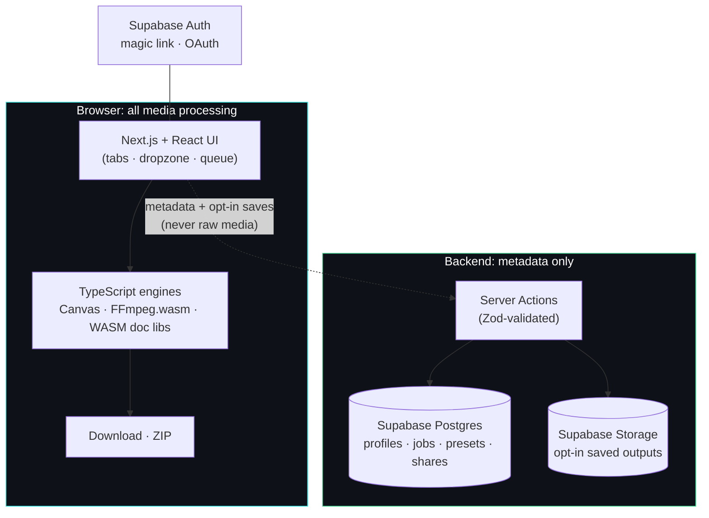
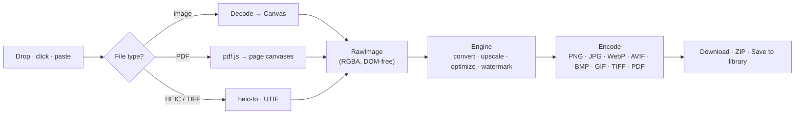
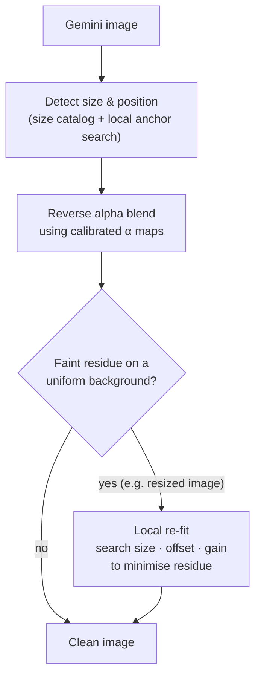
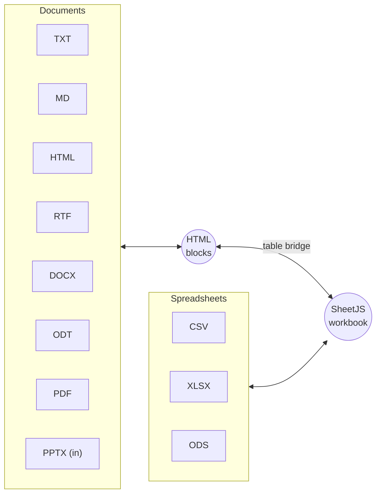

# ProxiPixel

ProxiPixel is a set of media tools that run in the browser. It converts, upscales and
compresses images, removes the visible Gemini watermark, transcodes video, converts
documents and spreadsheets, and edits PDFs. Your files are processed on your own device and
are never uploaded.

[](https://nextjs.org/)
[](https://react.dev/)
[](https://www.typescriptlang.org/)
[](https://tailwindcss.com/)
[](https://supabase.com/)
[](#testing)
[](./LICENSE)

## Overview

The app is built with Next.js 16 and TypeScript. All processing happens client-side, using
the Canvas API, FFmpeg compiled to WebAssembly, and engines written in TypeScript. The
backend (Supabase) only handles accounts: it stores job metadata, presets and, if you choose
to save one, a single output file. It never receives your original media.

Doing the work in the browser keeps files on your machine, costs nothing in server compute,
and means each user's browser handles its own load.

## Features

There are seven tools, each in its own tab:

| Tool | What it does | Formats |
| :--- | :--- | :--- |
| Convert | Re-encodes images between formats, including PDF to image and back | PNG, JPG, WebP, AVIF, BMP, GIF, TIFF, PDF; HEIC input |
| Upscale | Enlarges images up to 4K UHD with gamma-correct Lanczos resampling and Gaussian sharpening | Any image, up to 3840 px on the long edge |
| Optimize | Compresses to a target quality or a target file size (found by binary search) | AVIF, WebP, JPG, with an optional width cap |
| Watermark | Removes Gemini's visible watermark by reversing the alpha blend | PNG, JPG and WebP images from Gemini |
| Video | Transcodes, trims, crops, changes frame rate and mutes, using FFmpeg.wasm | MP4 (H.264), WebM (VP9), GIF |
| Documents | Converts documents and spreadsheets in both directions | DOCX, ODT, RTF, PDF, MD, HTML, TXT, XLSX, CSV, ODS; PPTX input only |
| PDF tools | Merges and splits PDFs; removes, extracts and reorders pages; rotates, crops margins and adds page numbers | PDF |

Every tool also has:

- A batch queue. Download results one at a time or as a ZIP.
- A before/after comparison slider for images and a preview for video.
- EXIF removal. Re-encoding drops GPS, camera and timestamp data, and each file's card shows
  what was removed.
- Optional accounts (Supabase) with job history, named presets and a library of saved outputs.
- Keyboard support for tabs, drop zones and sliders.

## Architecture

The browser does all of the media work. The server is small and stateless.


```mermaid
flowchart TB
    subgraph Browser["Browser: all media processing"]
        direction TB
        UI["Next.js + React UI<br/>(tabs · dropzone · queue)"]
        ENG["TypeScript engines<br/>Canvas · FFmpeg.wasm · WASM doc libs"]
        UI --> ENG
        ENG --> OUT["Download · ZIP"]
    end

    subgraph Backend["Backend: metadata only"]
        direction TB
        SA["Server Actions<br/>(Zod-validated)"]
        DB[("Supabase Postgres<br/>profiles · jobs · presets · shares")]
        ST[("Supabase Storage<br/>opt-in saved outputs")]
        SA --> DB
        SA --> ST
    end

    UI -. "metadata + opt-in saves<br/>(never raw media)" .-> SA
    Auth["Supabase Auth<br/>magic link · OAuth"] --- UI

    classDef browser fill:#0e1117,stroke:#34e0d8,color:#fff
    classDef backend fill:#0e1117,stroke:#3fcf8e,color:#fff
    class Browser browser
    class Backend backend
```

A few rules shape the code:

1. The engine doesn't depend on React or the DOM. Its functions work on `RawImage`, a
   DOM-free copy of the `ImageData` shape, so they can be unit tested in Node.
2. Heavy code loads on demand. The watermark engine (about 360 KB) and the document
   libraries are loaded with `import()` the first time they're used.
3. The server never sees your media. It records metadata only, and saving an output is
   something you do deliberately, one file at a time.

## How it works

### Image pipeline

All the image tools share one pipeline: decode, work on the raw pixels, encode.


```mermaid
flowchart LR
    A["Drop · click · paste"] --> B{File type?}
    B -->|image| C["Decode → Canvas"]
    B -->|PDF| D["pdf.js → page canvases"]
    B -->|HEIC / TIFF| E["heic-to · UTIF"]
    C --> F
    D --> F
    E --> F["RawImage<br/>(RGBA, DOM-free)"]
    F --> G["Engine<br/>convert · upscale · optimize · watermark"]
    G --> H["Encode<br/>PNG · JPG · WebP · AVIF · BMP · GIF · TIFF · PDF"]
    H --> I["Download · ZIP · Save to library"]
```

### Watermark removal

Gemini adds its logo with standard alpha blending. If you know the logo and its alpha map,
you can solve the blend equation for the original pixels, so the result is exact and no
generative model is involved:

$$\text{watermarked} = \alpha \cdot \text{logo} + (1-\alpha)\cdot\text{original} \quad\Longrightarrow\quad \text{original} = \frac{\text{watermarked} - \alpha \cdot \text{logo}}{1 - \alpha}$$


```mermaid
flowchart TB
    A["Gemini image"] --> B["Detect size & position<br/>(size catalog + local anchor search)"]
    B --> C["Reverse alpha blend<br/>using calibrated α maps"]
    C --> D{"Faint residue on a<br/>uniform background?"}
    D -->|"yes (e.g. resized image)"| E["Local re-fit<br/>search size · offset · gain<br/>to minimise residue"]
    D -->|no| F["Clean image"]
    E --> F
```

The local re-fit only runs over a uniform background, where a leftover ghost is both visible
and reliably fixable. On the standard size catalog its output is identical to the upstream
engine, and on native Gemini sizes the base removal is lossless.

### Document conversion

Documents convert through an intermediate model of HTML blocks, and spreadsheets through a
SheetJS workbook. A table bridge joins the two, so you can go from `XLSX` to Markdown or from
an HTML table to `CSV`.


```mermaid
flowchart LR
    subgraph DOCS["Documents"]
        direction LR
        TXT["TXT"]; MD["MD"]; HTML["HTML"]; RTF["RTF"]; DOCX["DOCX"]; ODT["ODT"]; PDF["PDF"]; PPTX["PPTX (in)"]
    end
    subgraph SHEETS["Spreadsheets"]
        direction LR
        CSV["CSV"]; XLSX["XLSX"]; ODS["ODS"]
    end

    DOCS <--> H1(("HTML<br/>blocks"))
    SHEETS <--> H2(("SheetJS<br/>workbook"))
    H1 <-->|"table bridge"| H2
```

The libraries are `mammoth` (reading DOCX), `docx` (writing DOCX), SheetJS (spreadsheets),
`marked` and `turndown` (Markdown to HTML and back) and `jszip` (ODT and PPTX). Legacy binary
`.ppt` files and `.pptx` export are out of scope, because doing them properly needs
LibreOffice running on a server.

## Tech stack

| Layer | Technology |
| :--- | :--- |
| Framework | Next.js 16 (App Router, Server Actions, React Server Components), React 19 |
| Language | TypeScript (strict) |
| Styling | Tailwind CSS 4, CSS custom properties |
| Image engine | Canvas API; Lanczos, unsharp mask, BMP and optimizer written in TypeScript; vendored Gemini watermark engine |
| Video | FFmpeg.wasm (loaded on demand) |
| Documents | SheetJS, mammoth, docx, marked, turndown, jszip |
| PDF tools | pdf-lib (loaded on demand) |
| Backend | Supabase (Postgres, Auth, Storage), Drizzle ORM, Zod |
| Tooling | pnpm, ESLint 9, Prettier, Vitest 5, Playwright |

## Project structure

```text
proxipixel/
├── app/                      # Next.js App Router (pages, layouts, routes)
│   ├── page.tsx              #   / (the studio, all tools)
│   ├── login/ library/ presets/ s/[slug]/   # auth, library, presets, public shares
│   └── auth/callback/        #   OAuth / magic-link callback
├── components/               # React UI
│   ├── Studio.tsx Tabs.tsx DropZone.tsx Queue.tsx ...
│   ├── panels/               #   Convert, Upscale, Optimize, Watermark, Video
│   ├── DocumentStudio.tsx    #   Documents tool
│   └── PdfToolsStudio.tsx    #   PDF tools tab
├── lib/
│   ├── engine/               # Media engine, framework-independent and unit tested
│   │   ├── upscale.ts encode.ts decode.ts optimize.ts raster.ts exif.ts pdf.ts
│   │   ├── pdftools.ts       #   merge, split, reorder, rotate, crop, page numbers (pdf-lib)
│   │   ├── video/            #   FFmpeg argument builder and runner
│   │   └── watermark/        #   typed wrapper around the vendored reverse-alpha engine
│   ├── docs/                 # Document and spreadsheet conversion
│   │   ├── formats.ts        #   format registry and conversion matrix
│   │   └── convert.ts        #   HTML hub, workbook hub and the bridges between them
│   ├── app/                  # Client state (store, process dispatch, types, toast, zip)
│   └── supabase/             # Browser, server and admin clients, middleware
├── server/                   # Server Actions: jobs, presets, outputs, shares, validation
├── db/                       # Drizzle schema, SQL migrations, RLS and storage policies
├── tests/                    # Vitest unit tests (engine, server, docs)
└── e2e/                      # Playwright end-to-end tests and sample files
```

## Quick start

### Prerequisites

- Node.js 22.12 or newer
- pnpm (`npm i -g pnpm`)
- A Supabase project (the free tier is fine). You only need this for accounts and history;
  every tool works without signing in.

### 1. Install

```bash
git clone https://github.com/Premchand006/ProxiPixel.git
cd ProxiPixel
pnpm install
```

### 2. Configure the environment

```bash
cp .env.example .env.local
```

Then fill in `.env.local`:

| Variable | Where to find it | Notes |
| :--- | :--- | :--- |
| `NEXT_PUBLIC_SUPABASE_URL` | Supabase → Settings → API | public |
| `NEXT_PUBLIC_SUPABASE_ANON_KEY` | Supabase → Settings → API | public |
| `SUPABASE_SERVICE_ROLE_KEY` | Supabase → Settings → API | server only, never prefix with `NEXT_PUBLIC_` |
| `DATABASE_URL` | Supabase → Database (pooled) | runtime |
| `DIRECT_URL` | Supabase → Database (direct) | migrations |
| `NEXT_PUBLIC_SITE_URL` | your app's URL | `http://localhost:3000` in development |

Without Supabase the app still runs and every tool works. Only sign-in, history and saving
to the library are turned off.

### 3. Set up the database (optional, for accounts)

```bash
pnpm drizzle:migrate          # apply migrations
# then run db/policies.sql, db/auth-setup.sql and db/storage-setup.sql in the Supabase SQL editor
```

### 4. Run

```bash
pnpm dev          # http://localhost:3000
```

## Testing

```bash
pnpm test         # Vitest: 80 unit tests (engine, server, docs)
pnpm test:e2e     # Playwright: 38 tests in a real browser, covering every tool
pnpm verify       # typecheck, lint, unit tests and build
```

Unit tests check the engine against the reference implementation: BMP header bytes, Lanczos
output size and constancy, gamma round-trips, EXIF GPS detection, FFmpeg argument strings,
and every document conversion in both directions.

End-to-end tests run Chromium against real sample files (in `e2e/fixtures/`, regenerated by
`generate.mjs`) and check the output bytes and MIME type for:

- every image input converted to every output format
- Upscale, Optimize and Watermark across their options
- every Documents conversion (document to document, sheet to sheet, and between the two)
- the Video pipeline from start to finish
- PDF tools: merge, rotate, remove pages, and the error for an invalid page range

Headless Chromium can't test AVIF encoding (it has no AVIF encoder) or heavy VP9/WebM
encoding (the 32 MB FFmpeg core reloads on every page), so those paths are covered by unit
tests of the encoders and argument builders instead. Both work in a normal Chrome or Edge.

## Scripts

| Script | Description |
| :--- | :--- |
| `pnpm dev` | Start the dev server |
| `pnpm build` / `pnpm start` | Production build / serve it |
| `pnpm verify` | `typecheck && lint && test && build` |
| `pnpm typecheck` | `tsc --noEmit` |
| `pnpm lint` / `pnpm format` | ESLint / Prettier |
| `pnpm test` / `pnpm test:e2e` | Vitest / Playwright |
| `pnpm drizzle:generate` / `pnpm drizzle:migrate` | Generate / apply database migrations |

## Privacy and security

- Media is processed in the browser. No third-party service sees your files, and nothing
  about them is sent anywhere.
- No third-party code loads at runtime. Every media library (FFmpeg.wasm, pdf.js, gifenc,
  UTIF, jsPDF) is a pinned npm dependency that is copied into the app at build time and
  served from the same origin. Nothing is fetched from a CDN, so the code that runs in your
  browser is the code that was built.
- The database stores metadata only: `kind`, source name, format and size, options, output
  size and a timestamp. It never stores media.
- Saving an output uploads that one file to your private Storage bucket, and only when you
  ask for it.
- Row Level Security (`db/policies.sql`) limits each user to their own rows.
- Every Server Action validates its input with Zod and takes the user's identity from the
  session on the server.
- `next.config.ts` sets a strict Content-Security-Policy and other security headers.

## Limitations

- Upscale uses classical resampling (gamma-correct Lanczos plus sharpening). It enlarges the
  detail that is already in the image; it can't add new detail the way a trained
  super-resolution model can.
- Watermark removal handles Gemini's visible logo in the bottom-right corner. It doesn't
  remove invisible SynthID marks or any other watermark.
- Documents: `.pptx` can be imported but not exported, and legacy `.ppt` isn't supported.
  Full Office fidelity would need LibreOffice on a server, which would mean uploading files.
- The PDF tools tab works with whole pages (merge, split, reorder, rotate, crop margins, page
  numbers). It can't edit or reflow the text on a page.

## Contributing

Run `pnpm verify` before opening a pull request. Typecheck, lint, tests and build all need
to pass.

## Acknowledgments

- The watermark engine (`lib/engine/watermark/vendor/`) is a vendored build of
  [gemini-watermark-remover](https://github.com/GargantuaX/gemini-watermark-remover) by
  GargantuaX, which is a JavaScript port of
  [Gemini Watermark Tool](https://github.com/allenk/GeminiWatermarkTool) by Allen Kuo. Both
  are MIT licensed. The reverse-alpha method and the calibrated masks are © their authors.
- ProxiPixel also uses [Next.js](https://nextjs.org/), [Supabase](https://supabase.com/),
  [FFmpeg.wasm](https://ffmpegwasm.netlify.app/), [SheetJS](https://sheetjs.com/),
  [mammoth.js](https://github.com/mwilliamson/mammoth.js), [docx](https://docx.js.org/) and
  [heic-to](https://github.com/hoppergee/heic-to) (HEIF/HEIC decoding).

## License

[MIT](./LICENSE). Vendored components keep their original MIT licenses and attribution (see
Acknowledgments).
